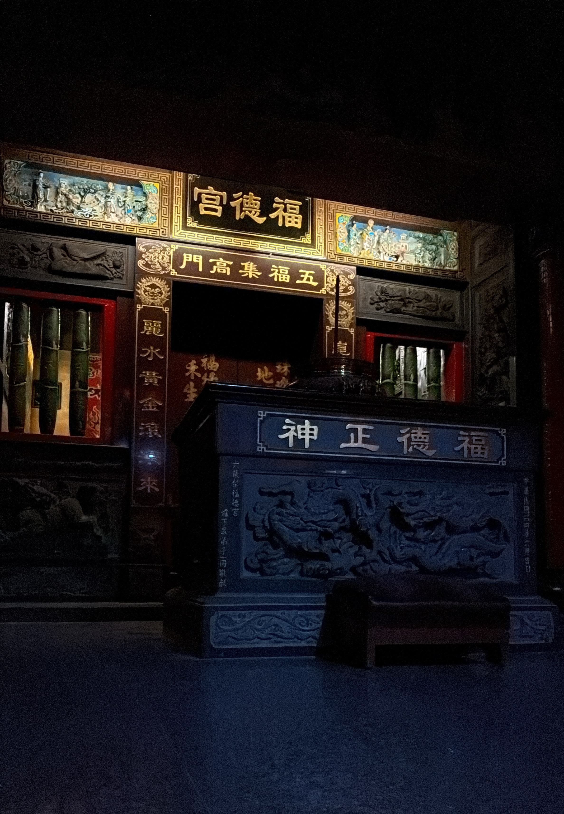
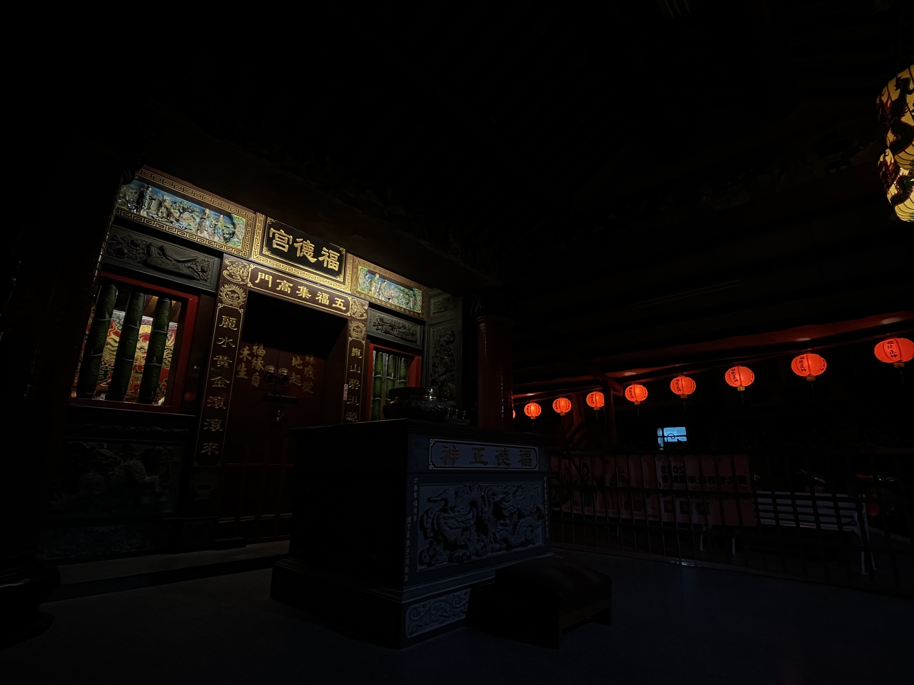
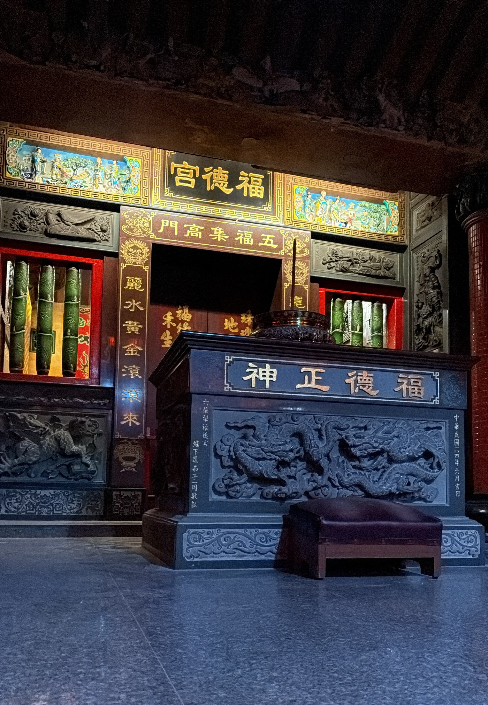
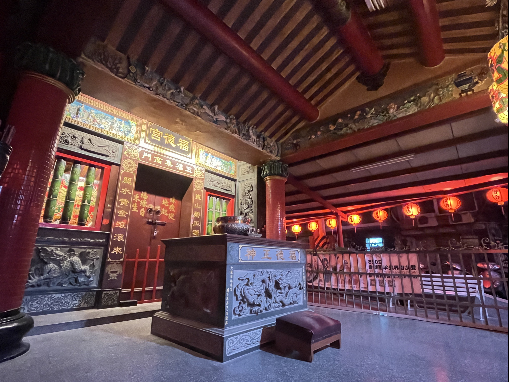
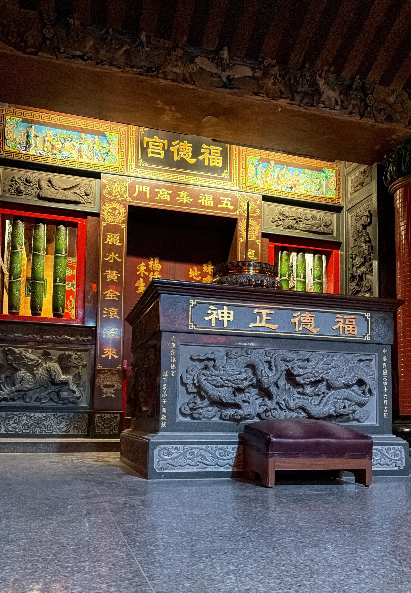
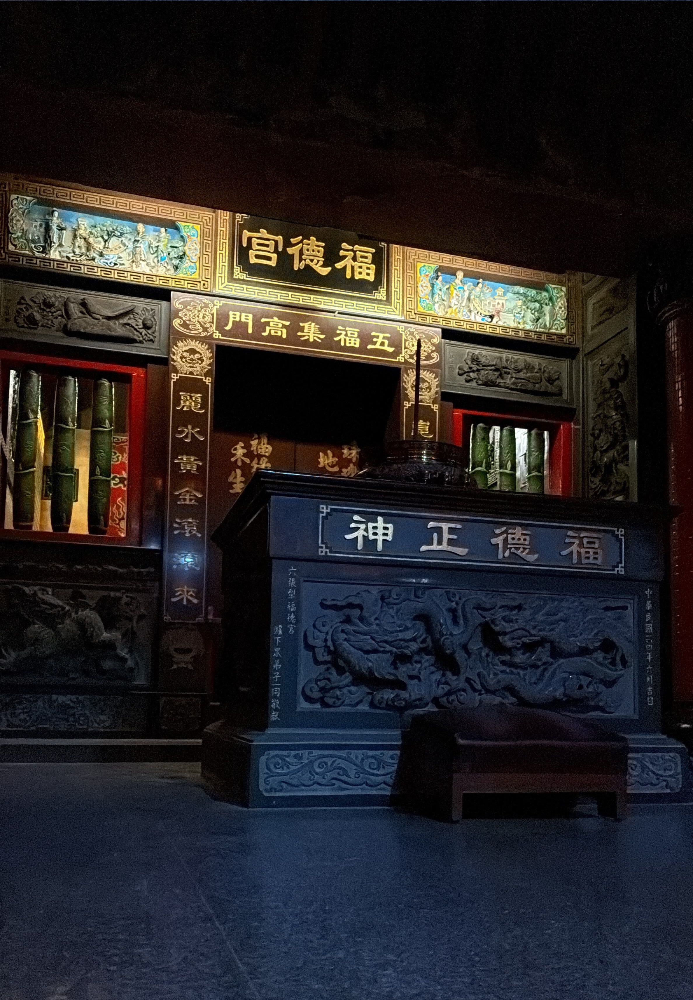
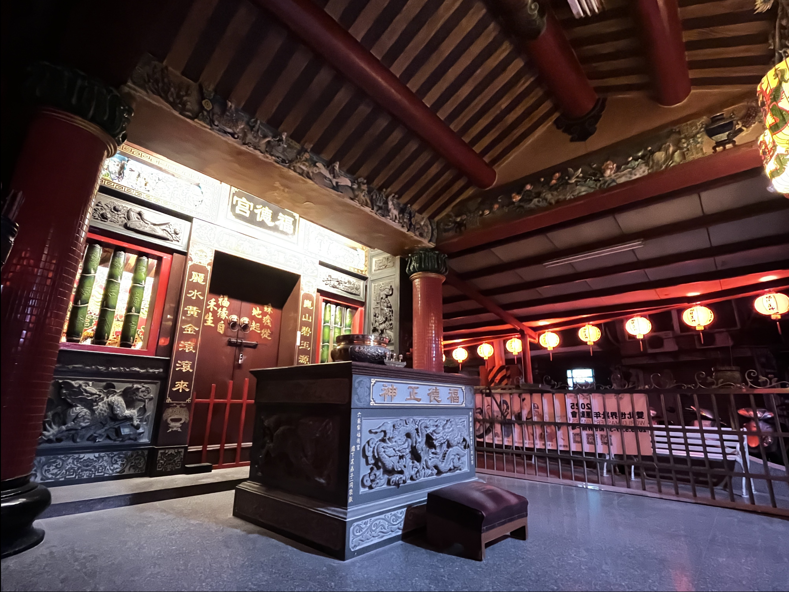

# VFX-Project1-HDR
## Description

This repo is about NTU VFX 2025 Spring Project1.
- Author: Lee Meng-Hsueh(R13922165), Wen Wen-An(R13944053)

- What we have done:
	- Roberston
	- Tone mapping - Biliteral (Bonus)
	- MTB alignment (Bonus)

- Report outline:

	1. Implementation of Roberston

	2. Implementation of Biliteral Tone-Mapping

	3. Implementation of MTB

	4. Summary of parameters

	5. Result 

## How to run the code
```bash=
git clone "this_repo"
cd VFX-Project1-HDR/src
```
## Command Examples (General Usage)
| Function            | Example Command                                                                                                                                                                                           |
|---------------------|------------------------------------------------------------------------------------------------------------------------------------------------------------------------------------------------------------|
| Alignment only      | `python pipeline.py align --input_folder [path_to_raw_image_folder] --output_folder [path_to_save_alignment_results]`                                                                                     |
| HDR only            | `python pipeline.py hdr --images [path_to_photo1] [path_to_photo2] [path_to_photo3] ... --exposures [exposure_time_1] [exposure_time_2] [exposure_time_3] ...`                                            |
| Tone mapping only   | `python pipeline.py tonemap --input [path_to_hdr_file] --output [output_image_filename, e.g., result.jpg]`                                                                                                |
| Full pipeline       | `python pipeline.py full --raw_folder [path_to_raw_image_folder] --aligned_folder [path_to_save_alignment_results] --exposures [exposure_time_1] [exposure_time_2] [exposure_time_3] ...`                 |

---

## Or you can run with the provided sample images:
| Function            | Example Command                                                                                                                                                                                           |
|---------------------|------------------------------------------------------------------------------------------------------------------------------------------------------------------------------------------------------------|
| Alignment           | `python3 pipeline.py align --input_folder ../Source_image --output_folder alignmented`                                                                                                                    |
| HDR                 | `python3 pipeline.py hdr --images alignmented/aligned_0.jpg alignmented/aligned_1.jpg alignmented/aligned_2.jpg alignmented/aligned_3.jpg alignmented/aligned_4.jpg --exposures 0.02 0.008 0.003125 0.00099900099 0.00061500615` |
| Tone mapping        | `python3 pipeline.py tonemap --input output.hdr --output result.jpg`                                                                                                                                      |
| **Full pipeline** | `python3 pipeline.py full --raw_folder ../Source_image --aligned_folder alignmented --exposures 0.02 0.008 0.003125 0.00099900099 0.00061500615`                                                            |

# Report
## Implementation of Roberston
### Problem Description
This method has several advantages: first, since the representation is non-parametric, the response function does not need to be assumed to have a shape described by some previously defined class of continuous functions; second, the formulation takes explicitly into account the sensor noise model; and third, the structure of the algorithm naturally uses all information available from image pixels for the estimation of response function and reconstruction of $E$.

Our goal is to reconstruct the $g$ (the inverse response curve) and then compute $E_i$  
* $Z_{ij} = f(E_i {\Delta} t_j)$ , where $i$ represents $i$-th pixel and $j$ represents $j$-th picture  
* $X_{ij} = E_i {\Delta} t_j$  
* $g:= \ln f^{-1}(Z_{ij})$ , i.e. $g: Z \to X$

Except in very specialized situations, the camera response function is not known a priori and must be estimated. To uniquely determine the response function, the 255 values $g(m), m=0,\dots,254$ must be found.

Robertson et al. exploit the Maximum Likelihood Method to estimate $g$. More formally,

$P(E_i, g | Z_{ij}, \Delta t_j) \propto exp\{ \frac{-1}{2} \sum\limits_{ij} w(Z_{ij})(g(Z_{ij}) - E_i \Delta t_j))^2\}$

Therefore, to maximize the likelihood, we need to minimize the expression:

$\sum\limits_{ij} w(Z_{ij})(g(Z_{ij}) - E_i \Delta t_j)^2$

Since the response function is not yet known, the weighting function (determined by differentiation of the response) is not known either. Rather than jointly attempting to estimate $w$, $g$, and $E$, the weighting function will be fixed _a priori_. (With so many unknowns, the estimation quickly becomes intractable, especially considering the dependence of $w$ on $g$.). Here we let $w(.)$ refer to the hat weighting function. (since $Z$ may overflow $(0 \sim 255)$, we need to add some adjustments, i.e., favor the numbers near the middle)

### Alternating Optimization (2 steps)

- **Step 1**: Assuming $g(Z_{ij})$ is known, estimate (optimize) for $\widehat{E_i}$
  - By first-order condition:
    
    $\widehat{E_i} = \frac{\sum\limits_{j} w(Z_{ij})g(Z_{ij})\Delta t_j}{\sum\limits_{j} w(Z_{ij})\Delta {t_j}^2}$

- **Step 2**: Assuming $E_i$ is known, estimate (optimize) for $\widehat{g}(Z_{ij})$
  - By first-order condition:
    
    $\widehat{g}(m) = \frac{1}{|\Phi_m|}\sum\limits_{ij\in E_m} E_i \Delta t_j, \quad \text{where } \Phi_m = \{(i, j)| Z_{ij} = m\}$
  
  - **Note**: We need to normalize the result so that $g(128) = 1$

### Iterative Estimation
Estimates for the variables of interest at the i-th iteration are denoted as $g^i$ and $E^i$. The initial estimate $g^0$ is chosen as a linear function, with $g^0(128) = 1$. The initial $E^0$  is determined using Step 1, based on the initial linear $g^0$.

This completes one iteration of the algorithm. The process repeats until a convergence criterion is met, defined as the rate of decrease in the objective function falling below a predefined threshold.
## Implementation of MTB alignment
### problem description
MTB (Median Threshold Bitmap) alignment addresses the challenge of aligning a set of images captured with different exposures, where even slight camera movements can lead to misalignment. This misalignment is particularly problematic in high dynamic range (HDR) imaging because even small shifts can cause ghosting or blurring when the exposures are merged.

### Translation to Bit Map

The input image is converted into an MTB (Median Threshold Bitmap). We use `cv2.cvtColor` to convert it to a grayscale image. Then, we compute the median of the grayscale image using `np.median` and use this median value as the threshold to binarize the image: pixels with values greater than or equal to the median are set to 1, and those with values less than the median are set to 0.

### Compute Error

We translate the image to be aligned by different offsets. This offset is a tuple representing the horizontal and vertical displacements. Then, we use a logical XOR operation to compare the reference image with the shifted MTB, summing the inconsistent pixels to obtain the total error. This process quantifies the similarity between the two binarized images.

### Finish Alignment

The core alignment is implemented in the `m_tb_align` function, which uses a multi-level pyramid approach (with `max_levels` defaulting to 4). It starts with coarse alignment at the lowest resolution and gradually refines the alignment. Specifically, at each level, the program first computes the scaling factor (`scale`, which is 2 raised to the power of the current level) and uses `cv2.resize` with `cv2.INTER_LINEAR` to scale the image so that its dimensions are reduced to 1/scale of the original size, enabling a fast search for approximate displacement. 

Next, at this level, the MTB of the reference image and the image to be aligned is computed, and, centered around the current known offset, the algorithm iterates through offset combinations in the range `[-1, 0, 1]`. For each candidate offset (calculated using `Compute error part`), after the error is computed, the candidate with the smallest error is chosen as the best offset for that level. After each level’s search, the offset is updated and then magnified and refined in the next level, eventually returning the best alignment offset at the original resolution. The program prints out the best offset and corresponding error at each level, allowing users to track the alignment process.

### Main Function

In our implementation, the first image in the folder is used as the reference image for alignment. The `align_images` function then applies the aforementioned alignment method by taking the first image of the loaded sequence as the reference and aligning the remaining images to it, storing their respective offsets. 

The main program uses `glob` to search for all images with a `.JPG` extension in the `"photo"` folder, reads them, and aligns them sequentially. Finally, it shifts the images using `np.roll` based on the computed offsets and saves the aligned images to the `"aligned"` folder. Note that `np.roll` produces a wrap-around effect; if this is not desired, you can use `cv2.warpAffine` to perform the translation and avoid wrapping. 

This entire process combines parameter settings with a multi-level search strategy to achieve precise image alignment, utilizing both median thresholding for binarization and multi-resolution adjustments with fine candidate offset searches.

## Implementation of Bilateral tone mapping

### Problem Description

At the core of the implementation is the `my_bilateral_filter` function, which operates on a 2D array representing a grayscale image. Bilateral filtering is a nonlinear technique that simultaneously considers spatial proximity and intensity similarity. For a given pixel $p$, the filtered output is computed as:

$$
I_{\text{filtered}}(p) = \frac{1}{W_p} \sum_{q \in \Omega} I(q) \, \exp\left(-\frac{\|p - q\|^2}{2\sigma_s^2}\right) \, \exp\left(-\frac{|I(p) - I(q)|^2}{2\sigma_r^2}\right)
$$

with the normalization factor:

$$
W_p = \sum_{q \in \Omega} \exp\left(-\frac{\|p - q\|^2}{2\sigma_s^2}\right) \, \exp\left(-\frac{|I(p) - I(q)|^2}{2\sigma_r^2}\right)
$$

Here, $I(q)$ denotes the intensity at pixel $q$ within the neighborhood $\Omega$. The parameter $\sigma_s$ controls the spatial decay, while $\sigma_r$ regulates the influence of intensity differences. This formulation ensures that pixels with large spatial distances or significant intensity differences contribute less to the output, thereby preserving edges while smoothing other regions.

### Image Mapping and Tone Mapping

The main image processing is performed in the `mapping` function. The input HDR image is first normalized to the range $[0, 1]$ by dividing by its maximum value. The function computes a grayscale representation by combining the RGB channels with weights of 0.114 for blue, 0.587 for green, and 0.299 for red, adding a small constant ($\epsilon = 10^{-6}$) to prevent numerical issues during the logarithmic transformation. The grayscale image is then transformed using the natural logarithm to compress the dynamic range.

Based on the image dimensions and the range of the log-transformed intensities, spatial and range standard deviations are computed. The spatial standard deviation is determined as the minimum of the image width and height divided by 16, while the range standard deviation is set to one-tenth of the difference between the maximum and minimum logarithmic values. These parameters are passed to the bilateral filter function to yield a smoothed version of the log-transformed image (denoted as `imgg`).

To fuse the base layer with the details, a gamma parameter (set to 1.1) is used. The fused main channel is computed via an exponential transformation:

$$
\text{main channel} = \exp\left(\gamma \cdot \text{imgg} + \left(\log(\text{val}) - \text{imgg}\right)\right)
$$


where $\text{val}$ represents the initial grayscale intensities. This approach effectively blends the smooth base with the high-frequency details extracted from the original log image.

Next, the original normalized RGB channels are scaled by the ratio $\text{main channel} / \text{val}$ for each channel, thereby reintroducing color while preserving the tone mapping adjustments. A gain factor of 1.1 is then applied to boost overall brightness, with the results clipped to remain within the $[0, 1]$ range.

### Gamma Correction and Final Output

In the final stage, a simple gamma correction is applied. Before this step, due to the overall low brightness of the image, we apply a gain factor of 50 to enhance the light intensity:
```python=
gain = 50  
out = np.clip(out * gain, 0, 1)
```
After boosting the brightness, a basic gamma correction is performed by raising the pixel values to the power of $1/5$ and scaling them to the 
$[0,255]$ range using the following operation:
```python=
outt = np.clip(np.power(out, 1.0 / 5) * 255, 0, 255)
```
This ensures that the final LDR output has improved brightness and contrast, making it visually closer to natural viewing conditions.

### Time Complexity Analysis

The most computationally intensive part of the implementation is the bilateral filtering step within the `my_bilateral_filter` function. The algorithm processes each pixel in the image using nested loops. For an image with dimensions **height × width** and a filtering window of size **diameter × diameter**, the worst-case time complexity is:
**O(height*width*diameter)**


This quadratic dependency on the window size means that as the **diameter** increases, the filtering step becomes significantly slower. In practice, due to the inherent nested loop structure implemented in Python without further vectorization or parallel processing, this tone mapping procedure typically requires around **5 minutes** to process a single HDR image on a standard machine.

### Conclusion
We implemented a simple version of bilateral tone mapping and provided some analysis of the algorithm. 
## Devices of parameters
Our shooting device was the iPhone 16 Plus. To maintain fixed EV and ISO, we used the Pro Camera app for capturing. The ISO was set at 4000, the aperture at 1.6, and the focal length at 22mm. We took five photos with different shutter speeds, then combined them into an HDR image using our self-developed Robertson method, and finally applied GIMP's built-in open-source tone mapping algorithm, Mantiuk 2006, for the final mapping.
## Result
To illustrate our results, we present the following image comparison in a 1x2 table format:

Input Images(Original)| Input Images (Aligned) | Mantiuk Tone Mapping | Our bilateral tone mapping
|-----------------------|------------------------|-----------------------------|--------------------|
|    |   |
|    |   |  | 
|     |   |
|     |   |
|      |   |
## Reference:
https://pages.cs.wisc.edu/~csverma/CS899_09/s00103ed1v01y200711cgr003.pdf
https://www.spiedigitallibrary.org/journals/journal-of-electronic-imaging/volume-12/issue-02/0000/Estimation-theoretic-approach-to-dynamic-range-enhancement-using-multiple-exposures/10.1117/1.1557695.full
